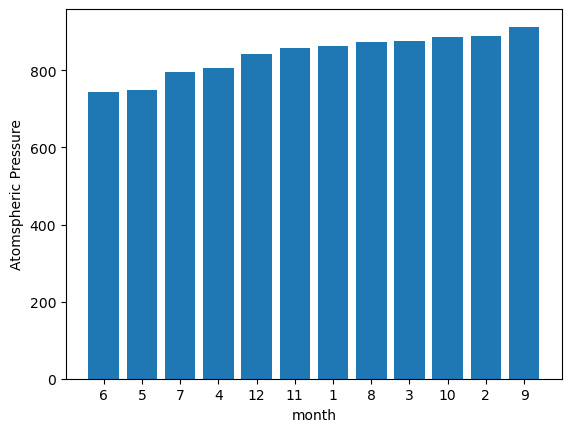

# Mission-to-Mars
## Overview 
This project is to help Robin who took on the full web-scraping and analyzed data for the mission to Mars. The automated browsing with Splinter and HTML parsing with Beautiful Soup wer used to extract information. 

## Analysis Results
1. How many months exist on Mars?

2. How many Martian (and not Earth) days worth of data exist in the scraped dataset?

    1867

3. What are the coldest and the warmest months on Mars (at the location of Curiosity)? 

    On average, the third month has the coldest minimum temperature on Mars, and the eighth month is the warmest. But it is always very cold there in human terms!

4. Which months have the lowest and the highest atmospheric pressure on Mars? 

    Atmospheric pressure is, on average, lowest in the sixth month and highest in the ninth.

5. About how many terrestrial (Earth) days exist in a Martian year? 

    The distance from peak to peak is roughly 1425-750, or 675 days. A year on Mars appears to be about 675 days from the plot. Internet search confirms that a Mars year is equivalent to 687 earth days.

    